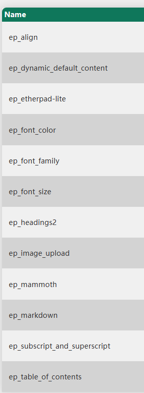

## 运行代码
1.	git clone https://github.com/J1mMilton/fitness4life.git
2.	SQL workbench在那个端口为3306，用户名为root的connection下新建一个数据库，名为appointmentsystem
3.	根据自己数据库的密码修改resources/application.properties
4.	在vscode打开文件，点开/main/java/com/CPT202/PetGroomingSystem中的PetGroomingSystemApplication.java 以非调试模式运行
5.	打开http://localhost:8080/home_page

# 文心一言api使用
https://github.com/baidubce/bce-qianfan-sdk/tree/main/java

# 共享文档api
目前使用的是开源的etherpad https://github.com/ether/etherpad-lite
安装说明 https://github.com/ether/etherpad-lite#installation
## 在Windows测试：
- **安装npm和node.js**
- 克隆该库放到项目下
- cmd 运行 `bin\installOnWindows.bat`
- 安装依赖成功后 run start.bat and open http://localhost:9001 in your browser.

### 安装的插件

### 跨域问题
- 依然存在，理论上应该用NGINX做反向代理

## 以下git的使用只是个人经验，建议网上找个视频也看看

## Git 常用使用指令（如果遇到网络问题无法push成功请百度解决）
git status 查看状态， 看看文件有没有增删改\
git add .  如果有增删改，就用add功能，把你本地编辑器（比如vscode）里的代码添加到另一个区域，可以add文件名，也可以只用. 就是添加全部文件，add的文件都会被添加到一个暂存区域（staging area）\
git commit -m "description" 暂存区域的代码可以被commit到本地的仓库（repository）里去，description替换成你对你做的事情的描述，写的详细清楚点好\
git push remote_name branch_name 本地仓库里的东西可以被push到远程仓库里去，远程仓库就是github （git和github是两个东西，git是version control的工具，github就只是一个远程repo，其他远程repo比如说有gitlab，gitee），一般都是git push origin main，其中origin就是你的本地仓库连接的远程仓库的昵称，你想改成别的也是可以的，main就是你想要推送的分支，在我们的项目里面请自己新建一个分支并且只推送到对应的分支，不要push到main里去\
git pull可以把本地vscode里的代码和远程仓库同步（pull其实相当于fetch+merge的两个操作，请小心使用）\
git remote -v 查看自己的local repository对应的remote repository\
关于master和main：传统上主分支都是master，但是因为master和slave这个不好的词有关系，所以你现在在github上创建的默认主分支叫main，（master和main是同个东西，用main只是为了避免master这个词）\

Workflow: Local code --> Staging area --> Local repository --> Remote repository\
Local code to Staging area: git add .\
Staging area to Local repository: git commit -m "something"\
Local repository to Remote repository: git push origin branch_name\
Remote repository to Local code: git pull origin branch_name\

## 添加分支合并分支
git branch 查看现有的分支\
git checkout -b new_branch 创建并转移到新分支\
git checkout branch_name 转移到现有的某个分支\
